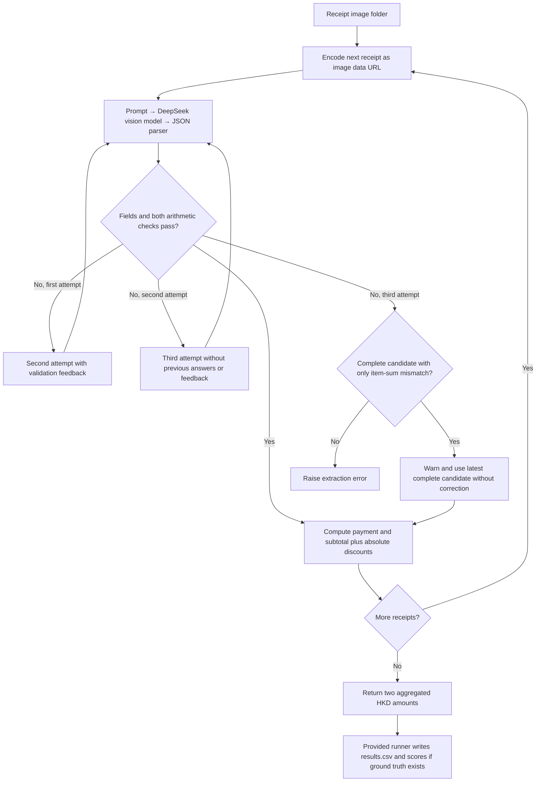

# FTEC5660 Homework 1: Receipt Chain

Build a LangChain pipeline that reads every supermarket receipt in a folder
with the vision-capable DeepSeek Flash model and answers these two questions:

1. How much money did I spend in total for these bills?
2. How much would I have had to pay without the discount?

For this homework, **amount spent** means the final payment after the receipt's
rounding line. **Without the discount** means the sum of the original positive
item prices: add back every promotion, coupon, member, app, packaging-damage,
and percentage discount, but do not add back rounding.

## Student task

Only edit the two functions in `hw1.py` that contain `### YOUR CODE HERE`:

- `build_chain()` creates your LangChain chain.
- `answer_queries()` runs the chain on the receipt images and returns one final
  response for each question.

You may use prompt chaining, routing, parallel calls, reflection, or a
combination. Your final responses should each contain one HKD amount. Do not
hard-code filenames or public answers; grading uses unseen receipt folders.

## Setup and public test

```bash
python3 -m venv .venv
source .venv/bin/activate
pip install -r requirements.txt
```

Put your DeepSeek key after `DEEPSEEK_API_KEY=` in `.env`, then run:

```bash
python3 hw1.py --image-folder public_test
```

The program creates `results.csv` in the current directory. Its columns are
`query`, `model_response`, and `correctness`. The public answers are in
`public_test/ground_truth.json`. Ground truth is used only by the provided
scoring code after prediction; it is not used for extraction or retries.
Keep `.env` local and excluded from Git.

The required model is `deepseek-v4-flash-vision-exp`, the vision-capable
DeepSeek Flash model. JPEG, PNG, GIF, and WebP inputs are accepted by the
homework runner.


## Homework 1 solution

The implementation separates visual transcription from monetary arithmetic.
`build_chain()` creates a LangChain pipeline consisting of `ChatPromptTemplate`,
`ChatDeepSeek` using `deepseek-v4-flash-vision-exp`, and `JsonOutputParser`.
For each receipt, the model transcribes actual negative amounts in the purchase
section's right-hand column rather than calculating offers from SAVE descriptions;
it also extracts item line totals, SUBTOTAL, signed ROUNDING, and final payment.
`answer_queries()` uses `Decimal` to validate the fields and check both
`item totals - absolute discounts = SUBTOTAL` and
`SUBTOTAL + ROUNDING = final payment`. Failed validation triggers a second
extraction with feedback; a third attempt independently transcribes the image
without previous answers or discrepancy values. The function sums final payments
for the first question and SUBTOTAL plus absolute discount amounts for the second,
excluding ROUNDING from discounts. Each answer contains exactly one HKD amount
with two decimal places. Only the two designated functions in `hw1.py` are
modified; the supplied argument parsing, ground-truth scoring, and CSV writer
remain unchanged.



### Validation

Two consecutive full public-test runs after the retry update produced the
following results. All seven receipts passed both checks on their first attempt,
with no retries or unverified-result warnings.

| Query | Model response | Public-test correctness |
| --- | --- | --- |
| How much money did I spend in total for these bills? | HK$1974.30 | correct |
| How much would I have had to pay without the discount? | HK$2348.20 | correct |

Local simulated checks also covered feedback retries, the independent third
attempt, bounded fallback, and unchanged answer formatting after removing verbose
logs. These simulations did not call the API. The two public runs did not exercise
the independent retry, and public-test success does not establish accuracy on
unseen receipts. A fresh-clone end-to-end run remains to be completed before
submission.

### Failure handling and limitations

Each receipt permits at most three extraction attempts; the API client separately
uses a 60-second request timeout and up to two retries for retryable request
failures. If no fully validated result is obtained, a complete candidate that
passed the payment check but failed the item-sum check may still be used with an
explicit `UNVERIFIED` warning. No balancing amount is invented. Missing or invalid
required fields with no eligible candidate, or exhausted API request failures,
can still terminate execution before CSV generation. Arithmetic consistency does
not guarantee correct visual recognition because multiple errors may cancel out.
